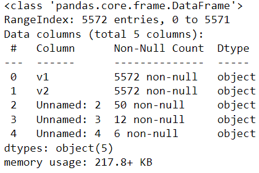

# Implementation-of-SVM-For-Spam-Mail-Detection

## AIM:
To write a program to implement the SVM For Spam Mail Detection.

## Equipments Required:
1. Hardware – PCs
2. Anaconda – Python 3.7 Installation / Jupyter notebook

## Algorithm
1.Import the necessary python packages using import statements.

2.Read the given csv file using read_csv() method and print the number of contents to be displayed using df.head().

3.Split the dataset using train_test_split.

4.Calculate Y_Pred and accuracy.

5.Print all the outputs.

6.End the Program.

## Program:
```
Program to implement the SVM For Spam Mail Detection..
Developed by: Anish Raj P
RegisterNumber:  212222230010
```
```python
import chardet 
file="CSVs/spam.csv"
with open(file,'rb')as rawdata: 
    result = chardet.detect(rawdata.read(100000)) 
result
import pandas as pd 
data=pd.read_csv("CSVs/spam.csv",encoding="'Windows-1252") 
data.head()
data.info()
data.isnull().sum()
x=data["v1"].values 
y=data["v2"].values
from sklearn.model_selection import train_test_split 
x_train,x_test,y_train,y_test=train_test_split(x,y,test_size=0.2,random_state=0)
from sklearn.feature_extraction.text import CountVectorizer 
cv=CountVectorizer()
x_train=cv.fit_transform(x_train) 
x_test=cv.transform(x_test)
from sklearn.svm import SVC 
svc=SVC() 
svc.fit(x_train,y_train) 
y_pred=svc.predict(x_test) 
y_pred
from sklearn import metrics 
accuracy=metrics.accuracy_score(y_test,y )  
accuracy
```

## Output:
### df.head():


### df.info():

### df.null():


### y_pred:


### Accuracy:


## Result:
Thus the program to implement the SVM For Spam Mail Detection is written and verified using python programming.
